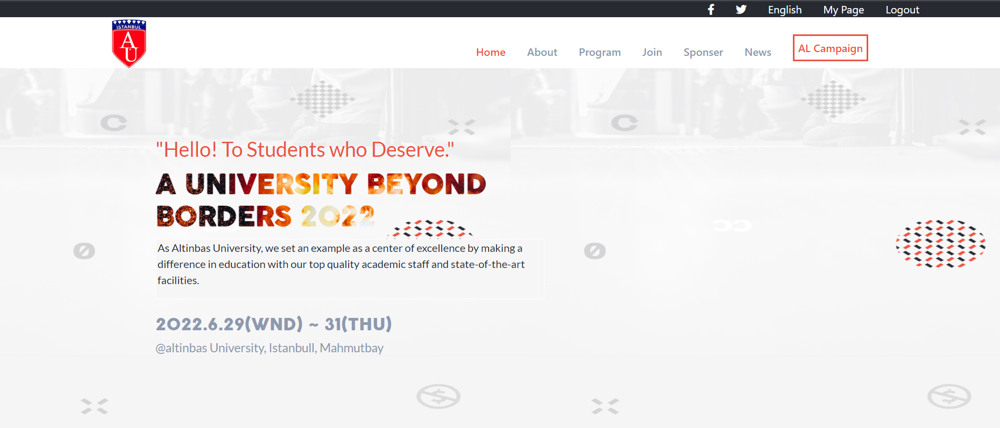

# Project Name
Altinbas Conference 2022 

# Project Link
https://alzubair98.github.io/first-capstone-project/

# Description.
Its a Project That Shows the Altinbas 2022 Conference Infromation

## Built With

- HTML & CSS & JS

# project image

## Live Demo (if available)

[Live Demo Link](https://alzubair98.github.io/first-capstone-project/)

## Authors

👤 **Alzubair**

- GitHub: https://github.com/Alzubair98
- Twitter: https://twitter.com/FitZubair
- LinkedIn: https://www.linkedin.com/in/alzubair-alqaraghuli-272918233/

# link to the explination video
https://www.loom.com/share/a0082d739b354bc0b10e08b086ac4541

## 🤝 Contributing

Contributions, issues, and feature requests are welcome!

Feel free to check the [issues page](https://github.com/Alzubair98/Hello---micro/issues).

## Show your support

Give a ⭐️ if you like this project!

## Acknowledgments

- this project was inspired from the original project of Cindy Shin 
  the link to the project (https://www.behance.net/gallery/29845175/CC-Global-Summit-2015)

## 📝 License

This project is [MIT](./MIT.md) licensed.